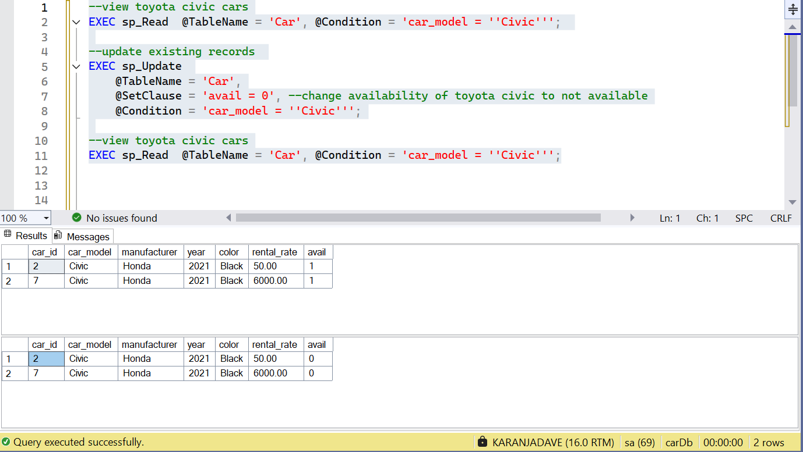
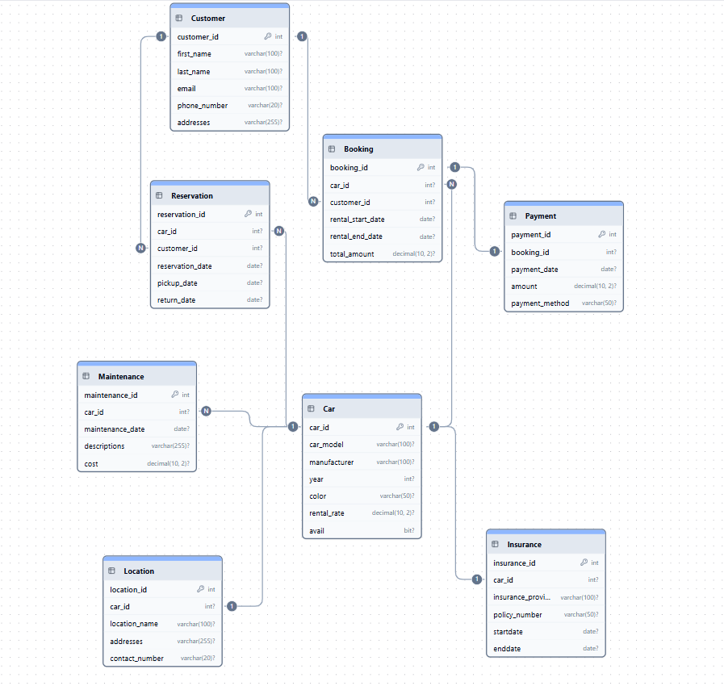

# Car Rental Management System (SQL Project)

> **Built a fully relational Car Rental Management Database using SQL Server (T-SQL)** with normalized tables, enforced relationships, and dynamic stored procedures for CRUD operations.

> 💡 *Click each section below to expand details.*

---

<strong>Overview</strong>

This project models a full **Car Rental Management System**, covering operations like car bookings, payments, reservations, maintenance, and insurance, all within SQL.

Developed as part of Week 3 of the **Teach2Give QA&QE training program** at Dedan Kimathi University of Technology, the project demonstrates how business logic can be handled directly in SQL using stored procedures to simplify and automate database CRUD operations.

---

<strong>Project Structure</strong>

| Folder | Description |
|---------|-------------|
| **`images/`** | Contains the Entity-Relationship Diagram (ERD) and query output screenshots. |
| **`scripts/`** | Includes SQL scripts: • `car_rental.sql` – creates the DB, schema, tables, inserts sample data, and calls stored procedures. • `car_rental_SP.sql` – defines generic stored procedures for CRUD operations. |
| **`docs/`** | Contains extended documentation like schema breakdowns and testing details. |
| **`README.md`** | The main project overview file (you’re reading it!). |

---

<strong>Database Design</strong>

The database follows a **normalized structure** to maintain data integrity and consistency across entities.

Core features include:
- **Primary & Foreign Keys** enforcing referential integrity  
- **Appropriate data types and constraints** for reliability  
- **Eight interconnected tables** modeling key business aspects like cars, customers, bookings, and maintenance  
<!-- For detailed table descriptions and schema layout, see [📘 Database Schema](./docs/schema.md) -->

---

<strong>Stored Procedures (SPs)</strong>

| Procedure | Function |
|------------|-----------|
| **`sp_Insert`** | Dynamically insert new records into any table |
| **`sp_Read`** | Retrieve records with optional filters |
| **`sp_Update`** | Update records based on specific conditions |
| **`sp_Delete`** | Delete records dynamically from any table |

These SPs use **`sp_executesql`** for dynamic query execution, simulating how a backend API interacts with a database layer.

---

<strong>Testing & Validation</strong>

All stored procedures were tested using **sample data** to ensure they handled dynamic inputs across tables.

Example: Used `sp_Read` and `sp_Update` to retrieve all Honda Civic cars, update availability, and confirm results through subsequent queries.

---

<strong>Challenges Faced</strong>

The toughest part was **debugging dynamic stored procedures** — handling variable SQL, parameters, and quotes.  

Through iteration, I learned to:
- Use SQL Server debugging tools effectively  
- Test one SP at a time before combining logic  
- Write cleaner, modular, and reusable SQL  

---

<strong>Version Control & Collaboration</strong>

Version control was managed on **GitHub**, ensuring clean commit tracking and documentation throughout the project.  

This experience reinforced real-world practices in collaborative database projects and structured version management.

---

<strong>Entity-Relationship Diagram</strong>

---

<strong>Acknowledgment</strong>

Special thanks to [**Brian Kemboi**](https://github.com/kemboi590), my trainer at Teach2Give, for his mentorship and practical guidance throughout the QA&QE program.

---

<strong>Author</strong>

**Dave Karanja**  
- [Email](mailto:davekaranja6@gmail.com)  
- [LinkedIn](https://www.linkedin.com/in/dave-karanja-83381b340/)  
- [GitHub](https://github.com/karanja-dave)

---

✨ *"Data is only as good as the structure that holds it — design carefully, query smartly."*
